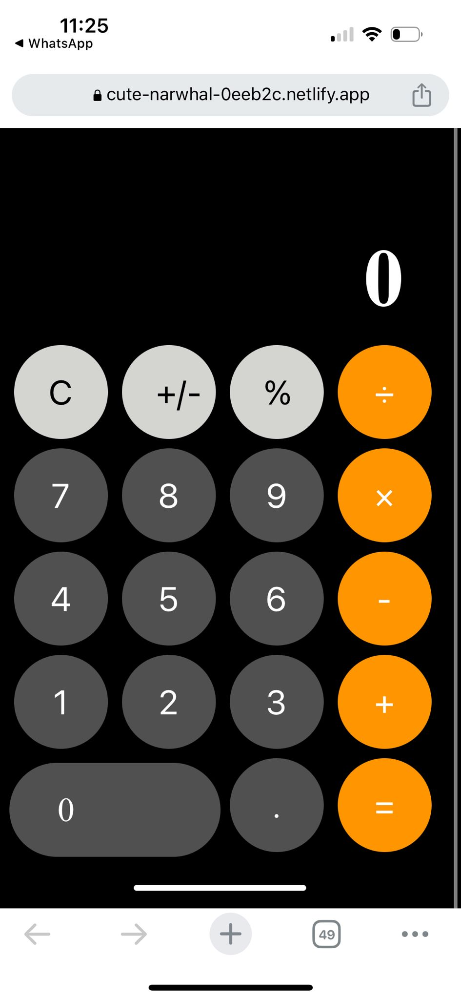

## My First Project
This is my first HTML/CSS project, where I made a calculator same as my Apple Iphone 14 pro. I came up with this in 2 hours. This is the basic project, after that I will be doing the full implementation of calculator using javascript. I just tried to replicate the same colors and font as my phone calculator which is not for Desktops.

## Challenges

Firstly, I took wrong dimension measurements, then I had to adjust height multiple times so that it can fit in my mobile environment. I had to change the positioning of some elements, so it looks same as the original calculator.

## What I learned

Basic HTML and mostly the CSS with good understanding of positioning and coloring. 

Here is the end product:

>[:NOTE]  
> Link to the website:  [click here](https://cute-narwhal-0eeb2c.netlify.app/)
